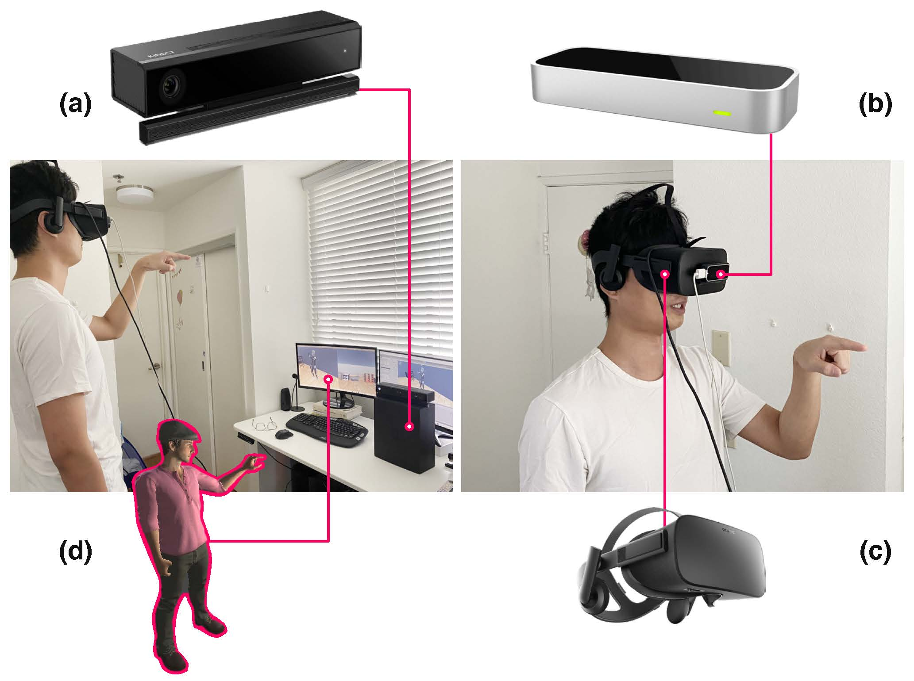

# Unity Development

If you wish to make changes, take recordings, check recordings for the Unity scenes/assets you will need to install Unity Editor version 2019.4.20 LTS for Windows (if you do not intend to use any sensors, you can also install for OSX/Linux) from [Unity Download Archive](https://unity3d.com/get-unity/download/archive).

## VR Development

VR development with GesTHOR is only tested with Windows 10. It allows you to make embodied human-robot interactions. The following devices are required for the full functionalities of the VR experience:

- Microsoft Kinect v2
- Leap Motion Controller
- Oculus Rift

(Note that all three devices are a bit out-dated since we started this project a few years ago and bought those devices. However, you can still buy them with a very low price. You could upgrade them with later version, but it is not guaranteed to work.)

Before you try out our VR setup, make sure all devices function well on your PC and install the latest softwares. In this folder, we have included the packages for all three devices. The packages can be found on their offical websites. Note that some scripts for Kinect control is from [Rumen Filkov](https://rfilkov.com/) (rumen.filkov@gmail.com). You can find more examples from [his package in the Unity Asset Store](https://assetstore.unity.com/packages/3d/characters/kinect-v2-examples-with-ms-sdk-18708#publisher).

### Unity Interface

The following contents assumes that you have some basic knowledge of Unity. If you are new to it, this [official learning channel](https://learn.unity.com/) is a perfect start.

This is the Unity Editor interface if you open this repository from Unity Hub. You can find (from left to right) the object hierarchy, object inspector, scene view, and game view.

From the hierarchy window, we can find different GmaeObjects in the scene. The first few GameObjects are set up similar to AI2-THOR. `MocapModule` object is added for VR setup. In this module you can find the control rigs for Kinect, Leap Motion, and Oculus. You can find all the objects and scripts in this [folder](Assets/GestureMocap).

### Gesture Recording

You can record the replay your gestures using our interface. Check the [scripts](Assets/GestureMocap/Scripts) if you want to know the details of it or modify according to your needs.

Here I show an example of gesture recording process. You can also check the information on the original paper and [my thesis](https://drive.google.com/file/d/1suaTvYLZPIecPQbImireO54LlrErBwO0/view?usp=sharing).

1. Open the Unity Editor and install XR plugins. Check [here](https://developer.oculus.com/documentation/unity/) on prerequisites to develop Oculus applications. Make sure necessary script components in Game Objects `LMHeadMountedRig` and `KinectController`.

2. Wear your Oculus Rift headset with Leap Motion Conroller correctly mounted. Set up your Kinect in a proper height and stand in a position to make sure that your full skeleton can be tracked. See the image below for a setup.

3. Hit `Play` in Unity Editor. When you hit play, you will be able to see the following screen. This is a pre-set program to record gestures. You can press `Space` or speak "start" to initiate the recording process. The recorded programs are used for the object navigation task. Therefore, you will see an object highlighted with red in each program. You need to speak an instruction to guide the robot to navigate to that object (e.g., if the target is an apple, you can say "go to that apple"). After your speech ends, show your referential gestures to the robot within 3 seconds. Your motion with 100 frames will be saved as a csv file with all joint coordinate information. Check this [file](Assets/GestureMocap/Scripts/MocapController.cs) for detailed implementation.

4. You will notice that there are four parts saved: your voice of instruction as a `.wav` file, your first-person-view image as a `.jpg` file, your gestural motion as a `.csv` file, and a metadata `.json` file.

### Gesture Replaying

You can also replay a program with the `Gesture Replay` component. The interface is shown below:

- Seuqence length: The number of frames in a recorded motion. 100 by default.
- Loaded file path: This is the path of the metadata file. 
- Loaded model name: This is used to play synthesized gestures with pretrained model (in testing).
- Train/Val/Test (optional): specify which folder you should check (only use if you put files in three folders sperately during recording).
- Play Gesture from CSV File: hit if you are ready to replay a gesture. The robot and humanoid agents will be moved to specified locations defined in the meta file, and the robot will start displaying the written motions.

